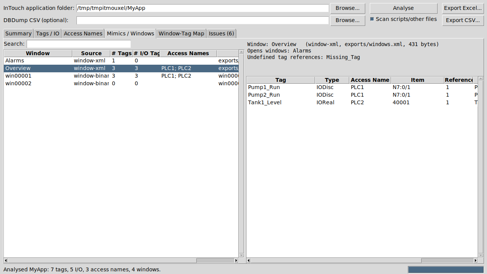

# InTouch IO & Mimic Analyser

A Python desktop app (Tkinter) that analyses an AVEVA/Wonderware **InTouch**
application folder and reports on its **I/O tags**, **access names** and
**mimics (windows)**, and on which tags each mimic uses.



## Features

| Tab | What it shows |
|-----|---------------|
| **Summary** | Counts of tags by type, I/O tags, access names, windows, unused/alarmed tags, and a **historical logging breakdown**: how many tags are stored at each rate (e.g. `Cyclic 10 s`, `Cyclic 1 min`, `On change`, `On change (deadband 0.5)`), split into I/O and Memory. Double-click a rate to list its tags. |
| **Tags / IO** | Every tag with type, access name, PLC item/address, group, comment, alarm flag, history rate and the windows using it. Filter by text, type (I/O, Memory, IODisc...), access name, history rate, used/unused. Double-click a tag for full details and all references. |
| **Access Names** | Application/topic (DAServer/OI server), advise mode, protocol, failover partner, tag count. Double-click to list that access name's tags. |
| **Mimics / Windows** | Every window with tag and I/O-tag counts and the access names (PLCs) it depends on. Select one to see its tags, their PLC addresses, windows it opens (`Show "..."`), remote references (`Access:Item`) and references to undefined tags. |
| **Window-Tag Map** | Flat window → tag cross-reference (searchable) |
| **Issues** | I/O tags with no/undefined access name, missing item names, duplicate PLC addresses, unused access names, references to undefined tags, windows with no tags, unused tags |

Everything can be exported to **Excel** (one formatted sheet per table) or **CSV**.

## Requirements

* Python 3.8+ with Tkinter (included with the standard Windows installer from python.org)
* Optional: `openpyxl` for Excel export — `pip install -r requirements.txt`

No other dependencies.

## Running

```bat
python -m intouch_analyzer
```

or double-click `run_analyzer.pyw` on Windows. Then:

1. **Browse...** to the InTouch application folder (the one containing `tagname.x` and the `*.win` files).
2. Optionally select a **DBDump CSV** (recommended — see below). If left empty, any DBDump CSV in the application folder is used automatically.
   Optionally select a **Historian tag export** to get fixed storage rates (see below).
3. Click **Analyse**, then browse the tabs or **Export Excel...**.

Command line / headless use:

```bat
python -m intouch_analyzer "C:\InTouch\MyApp"                          :: GUI, analyses immediately
python -m intouch_analyzer "C:\InTouch\MyApp" --excel MyApp.xlsx       :: no GUI
python -m intouch_analyzer "C:\InTouch\MyApp" --dbdump tags.csv --csv out_folder --summary
python -m intouch_analyzer "C:\InTouch\MyApp" --history historian_tags.txt --excel MyApp.xlsx
```

## Getting the best results

### Tag database: use a DBDump CSV

`tagname.x` is a proprietary binary file. Without a DBDump the tool can only
extract tag *names* from it heuristically (no types, access names or PLC
addresses, and a few false positives). For full I/O analysis create a DBDump:

* WindowMaker → **Special → DB Dump...** (or run `DBDump.exe`), and save the CSV
  into the application folder or select it in the GUI.

Both ANSI and Unicode (UTF-16) DBDump files are supported.

### Historical logging / storage rates

* **From the DBDump:** InTouch's own historical logging stores on data change,
  so tags with `Logged = Yes` are reported as `On change`, or
  `On change (deadband X)` when `LogDeadband` is set. Any `Storage*`, `Log*` or
  `Hist*` rate/type columns in the DBDump are also used.
* **Fixed rates (e.g. every 10 s)** are normally configured in **AVEVA Historian**,
  not in the InTouch folder. Export the Historian tag configuration (a file with
  `TagName`, `StorageType` = Cyclic/Delta/Forced and `StorageRate` in
  milliseconds) and select it as **Historian tag export**, or pass
  `--history file.txt` on the command line. These settings override the DBDump's.
  Historian names with a node prefix (`Node.TagName`) are matched to the
  InTouch tag name, and Historian tags that don't match any InTouch tag are
  reported under Issues.

The Excel/CSV export includes a **History Rates** sheet with the counts.

### Windows (mimics)

* **`*.win` files** are scanned directly. They are binary, but animation-link
  expressions and window scripts are stored as text, so the tags they reference
  are found. Windows are listed by file name (e.g. `win00001`), since the
  binary format does not expose the window name reliably.
* **Exported XML windows** (WindowMaker → export windows to XML, InTouch
  2014 R2 and later) placed anywhere in (or below) the application folder are
  also parsed, and show real window names.

With **Scan scripts/other files** ticked, other files in the application folder
(e.g. application/condition/data-change scripts) are scanned too and listed in
the Window-Tag Map as "script/other". Historical logs, images and binaries are skipped.

### How references are matched

Text found in windows/scripts is split into identifiers and matched,
case-insensitively, against the tag dictionary. `Tag.DotField` (e.g.
`Tank1_Level.MaxEU`) counts as a reference to `Tank1_Level`. `X.Value`-style
references where `X` is not a defined tag are reported as undefined-tag issues.
Because matching is text-based, a tag whose name is also an ordinary word
(e.g. a tag named `Pump` and a text label "Pump") may be over-counted.

## Project layout

```
intouch_analyzer/
  analyzer.py   folder scan, window/script parsing, cross-referencing
  dbdump.py     DBDump CSV parser + tagname.x fallback
  history.py    historical logging mode / storage rate (DBDump + Historian export)
  binscan.py    string extraction and tag-reference matching
  models.py     Tag / AccessName / Source / AnalysisResult + issue checks
  export.py     report tables, Excel and CSV export
  gui.py        Tkinter GUI
  cli.py        command line
tests/          unit tests using a synthetic InTouch application
```

Run the tests with `python -m unittest discover -s tests`.
